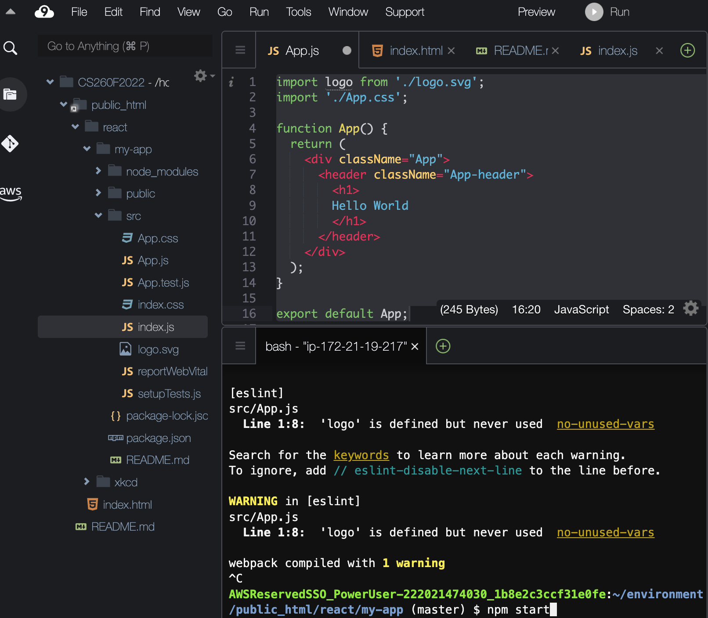
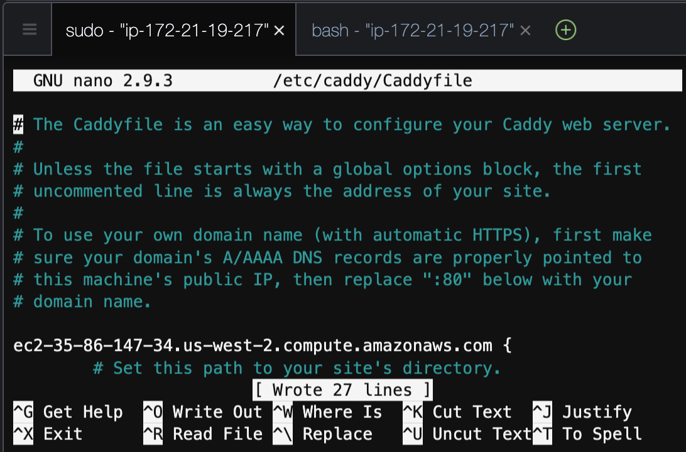

# learning the React Command Line Interface (CLI)

Although you can create full applications in a html file, most developers will use the Command Line Interface to automate many of the tasks you had to do by hand in the last module.

# Hello World

We are going to repeat the learning activities from the last module using the CLI interface to make sure you understand what is going on.  First, go to the command line in your Cloud9 window. Change to the public_html directory and enter the following command:
```
npx create-react-app my-app
```
This will install a bunch of libraries using the "Node Package Manager" npm.  When it finishes, you should see the following directory structure:
* ```node_modules```
  * This directory contains all of the libraries that will be used by your application 
* ```public```
  * This directory contains the static content for your application
    * ```index.html``` contains the ```    <div id="root"></div>``` tag that react will populate.
* ```src```
  * This directory contains the javascript source
    * The most important file is ```App.js``` that contains the ```<App>``` tag that will be rendered when your react app runs.
    * It is called by ```index.js``` which finds the ```<div id="root"></div>``` tag in the DOM and populates it with the contents of App.js.

You will learn about the other files in this directory as you experiment with your new React application.  For now, just replace the contents of App.js with the following
```
import logo from './logo.svg';
import './App.css';

function App() {
  return (
    <div className="App">
      <header className="App-header">
        <h1>
        Hello World
        </h1>
      </header>
    </div>
  );
}

export default App;
```
## Running your React App
You can run your React app by entering the following from the command line while you are in the in the ```my-app``` directory. 
You can issue the ```cd my-app``` command to change directory.  Then run ```npm start```.
```
cd my-app
npm start
```



You should be able to view the running app by selecting "preview" and "Preview Running Application"


